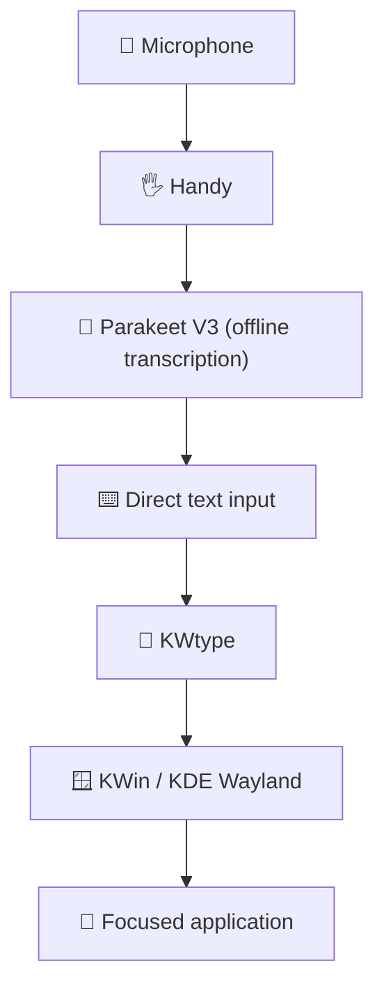

<div align="center">

# 🎙️ Handy Voice Dictation on Fedora KDE Wayland

**Fast, private, fully offline voice typing for Linux**
*Handy + KWtype + Parakeet V3*


</div>

---

A clean, copy‑paste setup guide for a **Fedora KDE Plasma Wayland** desktop where Handy needs to inject transcribed text into whatever app currently has focus.

> [!IMPORTANT]
> **On KDE Wayland, use `kwtype`, not `wtype`.**
> `wtype` relies on the Wayland virtual keyboard protocol, which KWin does not provide in the required way. `kwtype` uses KDE's **KWin Fake Input** protocol instead.

## 🔄 How it works



## ⚡ TL;DR

```text
 1. 📦 Install Fedora dependencies
 2. 🔨 Build & install KWtype
 3. ✅ Verify and test kwtype in a text field
 4. 📥 Download the latest Handy x86_64 RPM
 5. 🔧 Install it with DNF
 6. ⚙️  Set Typing Tool = kwtype, Paste Method = Direct, Auto Submit = Off
 7. 🦜 Download the Parakeet V3 model inside Handy
 8. 🎙️ Test voice typing
```

## 📑 Table of contents

| # | Step |
| --- | --- |
| 1 | [📦 Install dependencies](#step-1) |
| 2 | [⌨️ Install a typing tool (KWtype)](#step-2) |
| 3 | [✅ Verify KWtype](#step-3) |
| 4 | [📥 Download Handy](#step-4) |
| 5 | [🔧 Install Handy with DNF](#step-5) |
| 6 | [🔍 Verify Handy](#step-6) |
| 7 | [⚙️ Configure Handy](#step-7) |
| 8 | [🦜 Install Parakeet V3](#step-8) |
| 9 | [🎤 Select your microphone](#step-9) |
| 10 | [🧪 Test the full pipeline](#step-10) |
| 11 | [⌨️ Optional: KDE global shortcut](#step-11) |
| 12 | [🏁 Final checklist](#step-12) |
| 🛠️ | [Troubleshooting](#troubleshooting) |

---

<a id="step-1"></a>
## 📦 1. Install dependencies

Copy and paste this **single command**:

```bash
sudo dnf install -y git gcc-c++ meson ninja-build pkgconf-pkg-config qt6-qtbase-devel kwayland-devel libxkbcommon-devel wayland-devel gtk-layer-shell
```

<details>
<summary>🤔 What are these packages for?</summary>

| Package | Purpose |
| --- | --- |
| `git` | Clone the KWtype source |
| `gcc-c++` | C++ compiler |
| `meson`, `ninja-build`, `pkgconf-pkg-config` | Build tools |
| `qt6-qtbase-devel` | Qt 6 (needed by KWtype) |
| `kwayland-devel` | KWayland (needed by KWtype) |
| `libxkbcommon-devel` | Keyboard layout library (needed by KWtype) |
| `wayland-devel` | Wayland client headers |
| `gtk-layer-shell` | Runtime library Handy uses for its recording overlay |

</details>

---

<a id="step-2"></a>
## ⌨️ 2. Install a typing tool

Handy needs a tool that "types" the transcribed text into the focused app. Pick the one that matches your desktop:

| 🖥️ Your desktop | 🔧 Typing tool | What to do |
| --- | --- | --- |
| **KDE Plasma (Wayland)** ← this guide | `kwtype` | Follow **2A** below |
| Sway / Hyprland and other wlroots compositors (Wayland) | `wtype` | Follow **2B**, then skip to [Step 4](#step-4) |
| X11 (any desktop) | `xdotool` | Follow **2B**, then skip to [Step 4](#step-4) |
| GNOME (Wayland) | `wtype` generally does **not** work | See [Handy's Linux notes](https://github.com/cjpais/Handy#linux-notes) |

### 🟦 2A. KDE Wayland → build KWtype

**1️⃣ Download**

```bash
cd ~/Downloads
git clone https://github.com/Sporif/KWtype.git
```

**2️⃣ Enter the folder**

```bash
cd ~/Downloads/KWtype
```

**3️⃣ Configure the build**

```bash
meson setup --buildtype=release --prefix=/usr/local build
```

**4️⃣ Build**

```bash
meson compile -C build
```

**5️⃣ Install system-wide**

```bash
sudo meson install -C build
```

### 🟩 2B. Not KDE Wayland → use another tool

```bash
# wlroots Wayland (Sway, Hyprland, ...)
sudo dnf install -y wtype

# X11
sudo dnf install -y xdotool
```

Then continue with [Step 4 — Download Handy](#step-4).

---

<a id="step-3"></a>
## ✅ 3. Verify KWtype

Check whether Fedora can find KWtype:

```bash
command -v kwtype
```

Expected output:

```text
/usr/local/bin/kwtype
```

Check that it runs:

```bash
kwtype --help
```

<details>
<summary>❓ <code>command -v kwtype</code> returned nothing?</summary>

On Fedora, `/usr/local/bin` is normally already in your `PATH`, so this is rarely needed. First check whether the file exists:

```bash
ls -l /usr/local/bin/kwtype
```

If it exists, add `/usr/local/bin` to your shell's `PATH`.

**Bash**

```bash
grep -qxF 'export PATH="/usr/local/bin:$PATH"' ~/.bashrc || echo 'export PATH="/usr/local/bin:$PATH"' >> ~/.bashrc
source ~/.bashrc
```

**Zsh / Oh My Zsh**

```bash
grep -qxF 'export PATH="/usr/local/bin:$PATH"' ~/.zshrc || echo 'export PATH="/usr/local/bin:$PATH"' >> ~/.zshrc
source ~/.zshrc
```

**Fish**

```fish
fish_add_path /usr/local/bin
```

Then verify again:

```bash
command -v kwtype
```

> [!NOTE]
> Shell config files only affect **terminal** sessions. If Handy is launched from the app menu or autostart, it does not read them. After fixing your `PATH`, fully quit and restart Handy (log out and back in if needed).

</details>

### 🧪 Test KWtype

1. Open Kate, Firefox, Chrome, or any app with a text field.
2. Click inside the text field.
3. Run:

```bash
kwtype "Hello from KWtype on Fedora KDE Wayland"
```

The text should appear in the focused text field. ✨

> [!WARNING]
> **Do not continue until this test works.**

---

<a id="step-4"></a>
## 📥 4. Download Handy

Open the official release page:

👉 **https://github.com/cjpais/Handy/releases**

Download the latest:

```text
Handy-x.x.x-x.x86_64.rpm
```

| Your PC | Download |
| --- | --- |
| 💻 AMD / Intel 64-bit | ✅ `x86_64.rpm` |
| 📱 ARM | ❌ Do **not** use `aarch64` |

Save the RPM in:

```text
~/Downloads
```

---

<a id="step-5"></a>
## 🔧 5. Install Handy with DNF

```bash
cd ~/Downloads
```

```bash
sudo dnf install ./Handy-*.x86_64.rpm
```

> [!CAUTION]
> **Do not use `rpm -i`.**
> Use DNF so Fedora can resolve the required dependencies automatically.

---

<a id="step-6"></a>
## 🔍 6. Verify Handy

Check the executable:

```bash
command -v handy
```

Check that the package is installed (and which version):

```bash
rpm -qa | grep -i handy
```

Launch Handy:

```bash
handy
```

---

<a id="step-7"></a>
## ⚙️ 7. Configure Handy

Open **Handy → Settings** and use these values:

| Setting | ✅ Recommended value |
| --- | --- |
| ⌨️ **Typing Tool** | `kwtype` |
| 📋 **Paste Method** | `Direct` |
| 🚫 **Auto Submit** | `Off` |
| 📎 **Clipboard Handling** | `Don't Modify Clipboard` **or** `Copy to Clipboard` |
| 💤 **Model Unload** | `Never` **or** `After 15 minutes` **or** `After 1 hour` |
| 📍 **Overlay Position** | `Bottom` |
| 🌈 **Overlay** | `Live` |
| 🙈 **Start Hidden** | `On` |
| 🚀 **Launch on Startup** | `On` |
| 🔔 **Show Tray Icon** | `On` |

### 🎯 The three most important settings

```text
Typing Tool:  kwtype
Paste Method: Direct
Auto Submit:  Off
```

> [!WARNING]
> Do **not** select `wtype` on KDE Wayland.

> [!NOTE]
> Handy's own docs say the recording overlay is **off by default on Linux**, because some compositors treat it as the active window and it can steal focus from the app that should receive the text. If text doesn't appear after transcription, set **Overlay Position** to `None` (see [Troubleshooting](#troubleshooting)).

---

<a id="step-8"></a>
## 🦜 8. Install the Parakeet V3 transcription model

In Handy, go to:

```text
Settings → Models
```

Select **Parakeet V3** and download/install it from inside Handy.

### 💡 Why Parakeet V3?

Parakeet V3 is a great choice for a CPU-based Linux system:

| | |
| --- | --- |
| ⚡ | Fast local transcription |
| 🎯 | Good accuracy |
| 🧮 | CPU-optimized — no GPU needed |
| 🌍 | Automatic language detection |
| 🔒 | Completely offline |

For example, on a Ryzen 7 7700 with 16 GB RAM and no dedicated GPU, Parakeet V3 is a strong default. Handy's documented minimum is an Intel Skylake (6th gen) CPU or an equivalent AMD processor.

> [!TIP]
> **Everything working? You're done! 🎉**
> The remaining steps are for microphone setup, testing, an optional shortcut, and a final checklist.

---

<a id="step-9"></a>
## 🎤 9. Select your microphone

In Handy's audio settings:

```text
Microphone → Select your microphone
```

Make sure the correct input device is selected, then test recording.

---

<a id="step-10"></a>
## 🧪 10. Test Handy + Parakeet + KWtype

1. Open any text field, for example: 🦊 Firefox · 🌐 Chrome · 📝 Kate · 💬 Discord · ✈️ Telegram · 🤖 ChatGPT
2. Start Handy's transcription shortcut.
3. Speak normally. 🗣️
4. Stop the recording.

The transcribed text should automatically appear in the focused text field, following the pipeline from [How it works](#-how-it-works).

---

<a id="step-11"></a>
## ⌨️ 11. Optional: KDE global shortcut

Handy supports:

```bash
handy --toggle-transcription
```

You can bind this command to any KDE global shortcut.

**Go to:**

```text
System Settings
→ Shortcuts
→ Custom Shortcuts
→ Edit → New
→ Global Shortcut
→ Command/URL
```

| Field | Value |
| --- | --- |
| **Name** | `Toggle Handy Transcription` |
| **Command** | `handy --toggle-transcription` |
| **Example shortcut** | `Super + O` |

---

<a id="step-12"></a>
## 🏁 12. Final checklist

Run these one by one:

```bash
command -v kwtype
kwtype --help
command -v handy
rpm -qa | grep -i handy
```

Then confirm that:

- [ ] `kwtype` works by itself in a text field
- [ ] Handy detects `kwtype` in **Settings → Typing Tool**
- [ ] Typing Tool = `kwtype`, Paste Method = `Direct`, Auto Submit = `Off`
- [ ] Parakeet V3 is downloaded and selected
- [ ] Your microphone is selected
- [ ] Dictated text appears in the focused application ✅

---

<a id="troubleshooting"></a>
## 🛠️ Troubleshooting

<details>
<summary>🔎 Handy does not show <code>kwtype</code></summary>

Run:

```bash
command -v kwtype
```

If it returns nothing, follow the `PATH` fix in [Step 3](#step-3) for your shell (Bash, Zsh, or Fish).

If KWtype was installed into `~/.local/bin` instead, add that folder to your `PATH` the same way, then restart the terminal and Handy.

</details>

<details>
<summary>🚫 Handy uses Wtype</summary>

Open **Handy → Settings → Typing Tool** and set it to:

```text
kwtype
```

Do not use `wtype` on KDE Wayland.

</details>

<details>
<summary>👀 KWtype works in the terminal but Handy cannot see it</summary>

Completely close Handy (including the tray icon) and start it again. Then open **Settings → Typing Tool** — `kwtype` should now be available.

</details>

<details>
<summary>🤐 Handy transcribes but does not type anything</summary>

**1️⃣ Test KWtype on its own** while a text field is focused:

```bash
kwtype "Test text"
```

**2️⃣ Check Handy's settings:**

```text
Typing Tool:  kwtype
Paste Method: Direct
```

**3️⃣ Make sure the target app still has focus** when transcription finishes. The Handy overlay can steal focus from the app that should receive the text.

**4️⃣ Try disabling the overlay:** **Settings → Advanced → Overlay Position → `None`**. You can turn on **Audio Feedback** (same page) if you still want a sound when recording starts and stops.

</details>

<details>
<summary>💥 Handy crashes, won't start, or the overlay misbehaves on KDE Wayland</summary>

Try these in order:

**1️⃣ Make sure the runtime library is installed:**

```bash
sudo dnf install gtk-layer-shell
```

**2️⃣ Skip `gtk-layer-shell` for the overlay** (it has been reported to interact poorly with some KDE Wayland setups):

```bash
HANDY_NO_GTK_LAYER_SHELL=1 handy
```

**3️⃣ Disable the WebKit DMA-BUF renderer:**

```bash
WEBKIT_DISABLE_DMABUF_RENDERER=1 handy
```

**Making a fix permanent:** if Handy starts from a `.desktop` autostart file, prefix the `Exec=` line, for example:

```text
Exec=env HANDY_NO_GTK_LAYER_SHELL=1 handy
```

</details>

---

## 🔗 Official projects

| Project | Link |
| --- | --- |
| 🖐️ **Handy** | https://github.com/cjpais/Handy |
| 📦 **Handy Releases** | https://github.com/cjpais/Handy/releases |
| ⌨️ **KWtype** | https://github.com/Sporif/KWtype |

---

<div align="center">

### 🐧 Fedora KDE Wayland + Handy = **KWtype** + **Direct**

**Do not use Wtype on KDE Wayland.**

⭐ If this guide helped you, consider starring the repo!

</div>
